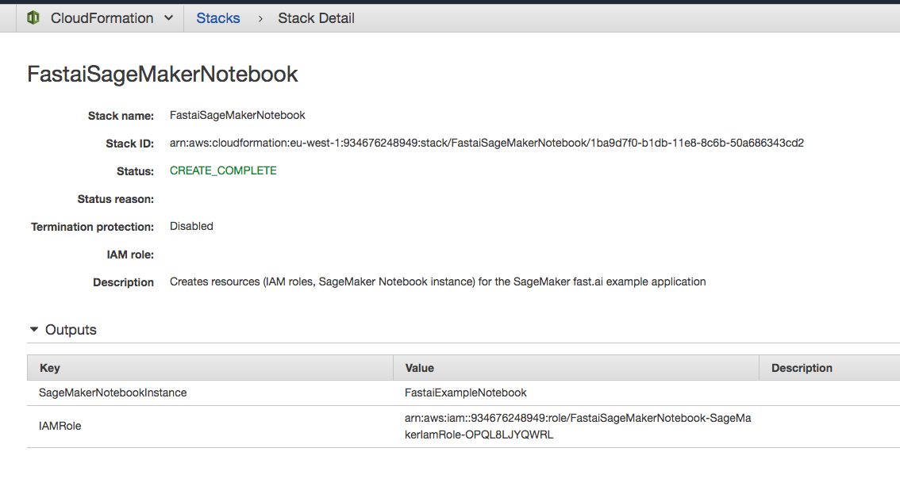
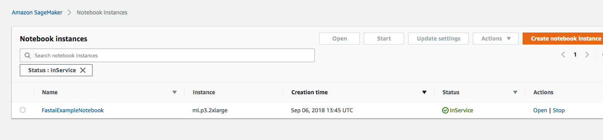
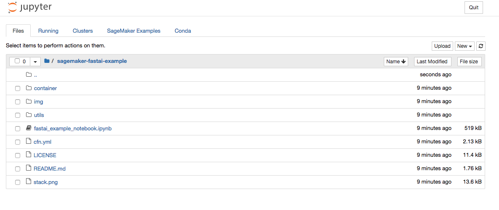

# SageMaker fast.ai example application
Example project showing how to train and deploy your fast.ai based model with Amazon SageMaker. Includes source code for training and inference of fast.ai application based on Lesson 1 of the fast.ai MOOC online course. Also includes a Jupyter notebook showing steps to build, train and deploy your models both locally on the notebook instance and with the Amazon SageMaker service.

## Setup

Follow the instructions below to setup your IAM role and SageMaker Notebook Instance.

We will use [CloudFormation](https://aws.amazon.com/cloudformation/) to create our resources via a template file. To do this,

1. Click the **Launch Template** button below to open the AWS CloudFormation Web Console to create a new CloudFormation stack. Click through the options and select the SageMaker instance type. The **ml.t2.medium** option is part of the AWS Free Tier. See the SageMaker [pricing page](https://aws.amazon.com/sagemaker/pricing/) for more details.

Region | Launch link
--- | ---
**eu-west-1** | 
**us-east-1** | 
**us-east-2** | 
**us-west-2** | 

Take note of the resources created including:
 - **IAM service role** allowing SageMaker access various AWS services
 - **SageMaker Notebook Instance** to run the exercises in the workshop.

2. Open the SageMaker Management console and select the SageMaker notebook instance named: **FastaiExampleNotebook** as per the screenshot below.

3. Select the folder named **sagemaker-fastai-example** and open the notebook named: **fastai_example_notebook.ipynb** as per the screenshot below.

